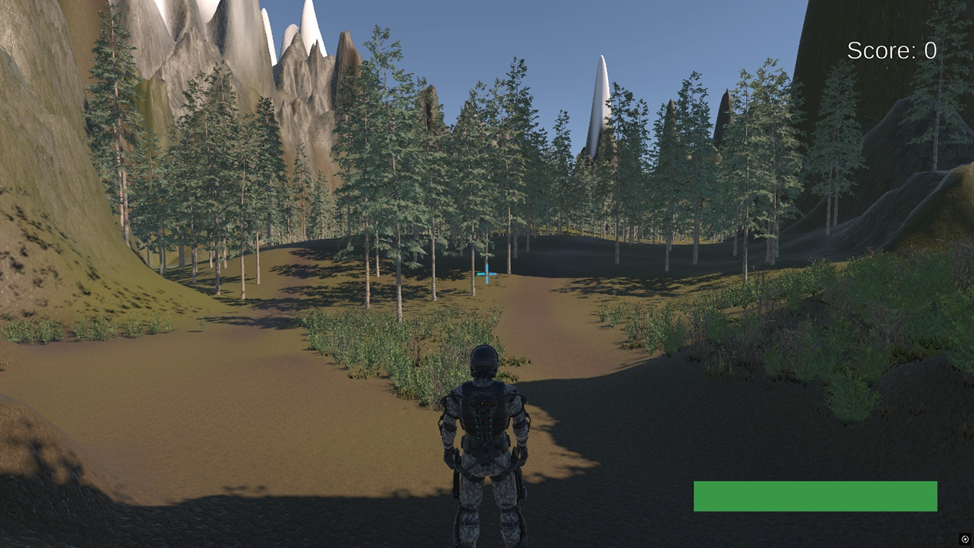
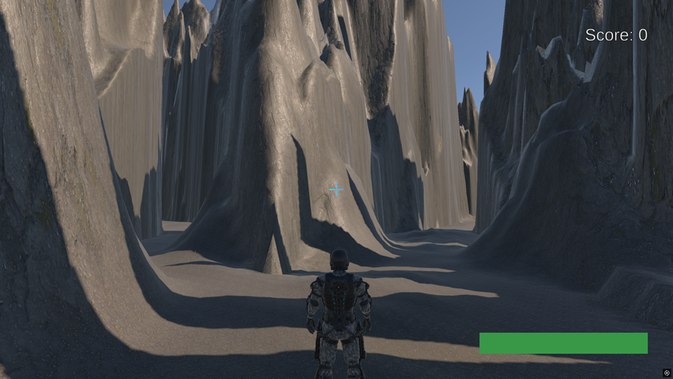
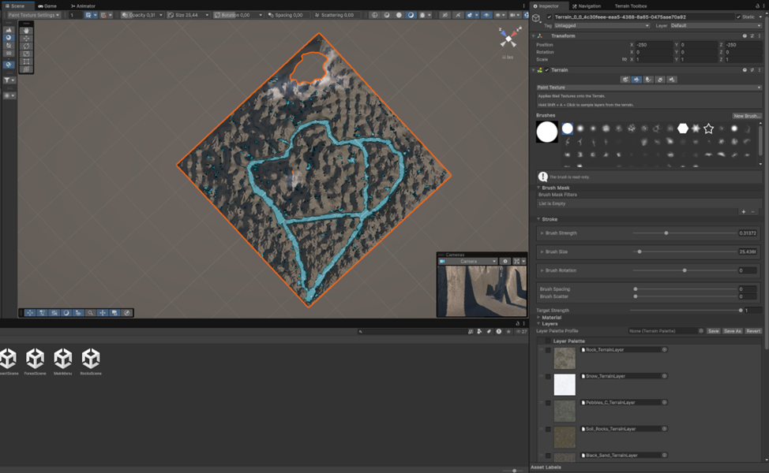
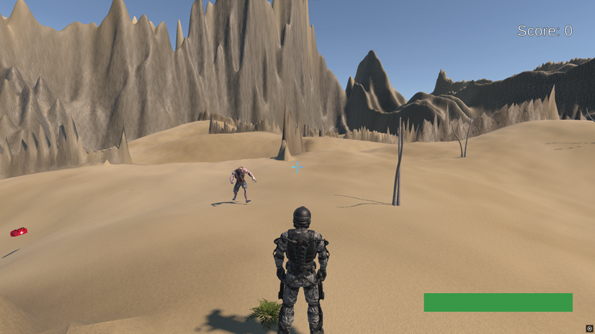
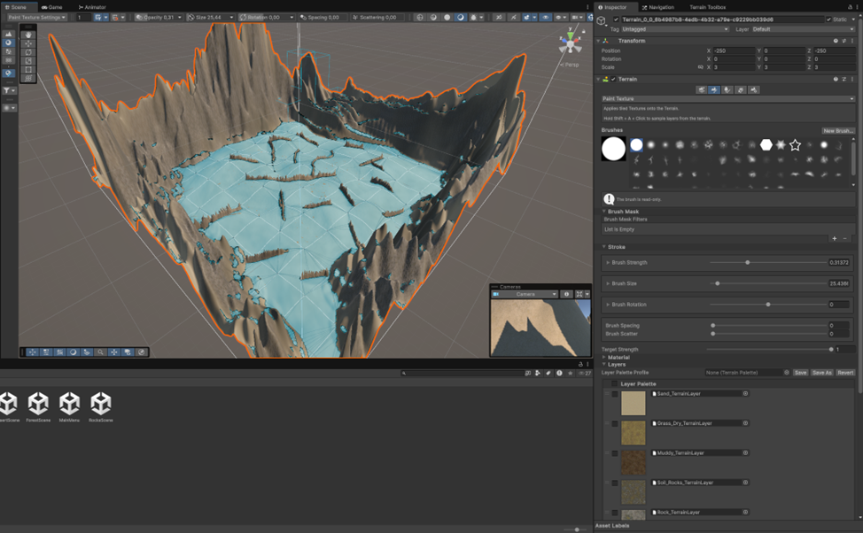

# Endless End 🎮

**Endless End** — это аркадная игра в жанре **Survivor Arena**, созданная на Unity. Ваша цель — выжить как можно дольше в замкнутом пространстве, полном все более агрессивных монстров, собирая очки и временные улучшения.

## 🔥 Особенности игры

- 🧟‍♂️ **Бесконечные волны монстров**: монстры становятся всё быстрее и опаснее по мере вашего выживания.
- 💀 **Безысходность**: вы не победите — вы лишь оттягиваете неминуемый конец.
- 🏃‍♂️ **Механика выживания**: собирайте дропы, чтобы увеличить шансы на выживание.
- 🌍 **3 уникальные карты**:
  - **Лес** — открытая местность с тропами и перепадами высот;
  - **Скалы** — узкие ущелья с ограниченным пространством для маневров;
  - **Пустыня** — пересечённая местность с засохшими растениями и скалами.
- ⏸️ **Меню паузы** — приостановите игру или покиньте её в любой момент.
- 🏆 **Система рекордов** — отслеживайте лучший результат прямо в главном меню.

## 🎮 Игровые объекты

- 💰 **Монета** — добавляет очки.
- ❤️ **Аптечка** — восстанавливает здоровье.
- ⚡ **Молния** — временно увеличивает скорость.
- 💉 **Шприц с антидотом** — заставляет монстров разбежаться.

## 📥 Скачать игру

Скачать последнюю версию:
👉 [Releases — Endless End v1.0.0](https://github.com/Remsely/mirea-unity-endless-end/releases/tag/1.0.0)

## 🧩 Исходный код

Исходники проекта:
👉 [Google Drive (архив)](https://drive.google.com/file/d/1_MwtkuNEQT7ZIRnuGYqL337_st34AHwQ/view?usp=sharing)

## 🛠️ Технологии

- Unity (2D/3D Environment Design)
- C#
- Terrain Tools
- Unity UI
- Physics & AI (NavMesh/Pathfinding)

## 📸 Скриншоты

### 🎮 Главное меню

### 🌲 Карта «Лес»
#### Вид от игрока:

#### В редакторе Unity:

---

### 🪨 Карта «Скалы»
#### Вид от игрока:

#### В редакторе Unity:

---

### 🏜️ Карта «Пустыня»
#### Вид от игрока:

#### В редакторе Unity:

---

### ⏸️ Меню паузы
